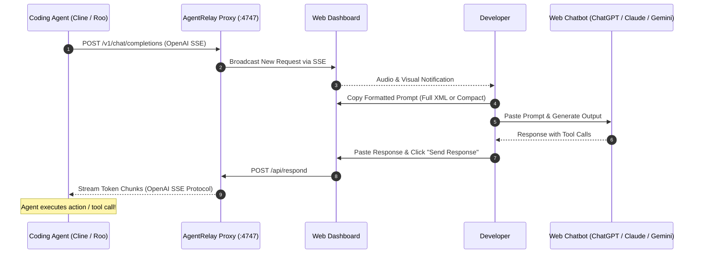

# AgentRelay

> **Human-in-the-Loop Proxy for Coding Agents**

[](https://nodejs.org/)
[](LICENSE)
[]()
[]()

**AgentRelay** is a lightweight, zero-dependency, OpenAI-compatible proxy server with a real-time web dashboard. It acts as an interactive bridge between autonomous coding agents (such as **Cline**, **Roo Code**, or any OpenAI-compatible client) and your favorite free/subscription web chatbots (**ChatGPT**, **Claude**, **Gemini**, **DeepSeek**).

---

## The Problem

Autonomous coding agents (like Cline) are game-changers for software engineering, but:
- **Skyrocketing API Costs**: Agents consume millions of tokens running iterative tool-call loops, reading files, and executing terminal commands. A single complex task can quickly run up high API bills.
- **Strict API Rate Limits**: Free tier and standard API keys frequently hit harsh requests-per-minute (RPM) and tokens-per-minute (TPM) limits.
- **Wasted Web Subscriptions**: Many developers already pay for web chatbot subscriptions (such as ChatGPT Plus or Claude Pro) with generous web usage, but cannot plug them directly into coding IDE extensions.

## The Solution

**AgentRelay brings the human into the loop:**

Instead of firing paid API requests directly to OpenAI or Anthropic, your coding agent sends requests to AgentRelay's local endpoint. AgentRelay intercepts the request, presents the formatted prompt on a clean local web dashboard, lets you copy it to any web chatbot, and streams the chatbot's response back to the agent using standard **Server-Sent Events (SSE)**.

To your agent, AgentRelay looks and behaves like an authentic, high-speed OpenAI streaming API.



---

## ✨ Key Features

- ⚡ **OpenAI-Compatible SSE API**: Seamlessly intercepts `/v1/chat/completions` and streams token chunks using standard Server-Sent Events (`data: {"choices": [...]}`). Works with any client expecting OpenAI format.
- 🖥️ **Real-Time Web Dashboard**: Powered by live SSE connections. Features instant push notifications, sound alerts, request counter badges, and responsive UI with zero manual page refreshes.
- 📝 **Smart Dual-Mode Prompt Formatter**:
  - **Full XML Format**: Preserves full system instructions, detailed tool definitions (`execute_command`, `read_file`, `write_to_file`, etc.), environment details, and uncompressed context.
  - **Compact Markdown**: Strips boilerplate tool schemas and condenses conversation history into a lightweight markdown summary—ideal for web chats with tighter context windows.
- 📋 **Auto-Copy & Smart Quick Paste**:
  - One-click copy for prompts.
  - Smart response submission with instant auto-trimming and keyboard shortcuts (`Ctrl+Enter` / `Cmd+Enter`).
- 🛡️ **Intelligent Input Sanitizer**:
  - Automatically detects and strips surrounding markdown code block wrappers (e.g. ```` ```xml ... ``` ````) that web LLMs often add around tool calls.
  - Preserves essential XML tool tags (like `<attempt_completion>`, `<ask_followup_question>`) to ensure the agent executes correctly without syntax errors.
- 🛑 **Request Cancellation & Abort Handling**:
  - Cancel pending requests at any time directly from the dashboard.
  - Automatically detects when Cline or the client disconnects or cancels the request, gracefully closing the connection without hanging the proxy or leaving orphan state.
- 🪶 **Zero External Dependencies**: Built entirely on native Node.js core modules (`http`, `fs`, `path`, `crypto`). No `npm install`, no dependency bloat, instant startup.

---

## 🚀 Quick Start Guide

### 1. Clone & Run

Ensure you have [Node.js](https://nodejs.org/) (v18.0.0 or higher) installed:

```bash
# Clone repository
git clone https://github.com/MohammadKermani/AgentPipe.git

# Navigate to project directory
cd AgentPipe

# Start AgentRelay (no npm install needed!)
npm start
```

You will see:
```text
[AgentRelay] Proxy server running at http://localhost:4747
[AgentRelay] Dashboard: http://localhost:4747
[AgentRelay] OpenAI endpoint: http://localhost:4747/v1/chat/completions
```

Open `http://localhost:4747` in your browser to access the dashboard.

---

### 2. Configure Your Coding Agent (e.g. Cline)

Configure [Cline](https://github.com/cline/cline) (or Roo Code) in VS Code to use AgentRelay as its provider:

| Setting | Value |
| :--- | :--- |
| **API Provider** | `OpenAI Compatible` |
| **Base URL** | `http://localhost:4747/v1` |
| **API Key** | `agentrelay` *(or any arbitrary string)* |
| **Model ID** | `gpt-4o` *(or `claude-3-5-sonnet`, `gemini-2.0-flash`)* |

> **Tip:** You can set any Model ID you like. AgentRelay accepts all model identifiers.

---

### 3. Workflow in Action

1. **Prompt Cline**: Give your agent a task in VS Code (e.g., *"Refactor auth middleware to support JWT"*).
2. **Dashboard Alerts**: AgentRelay's dashboard will chime and display the incoming request card.
3. **Copy Prompt**: Choose between **Full XML** (recommended for full capabilities) or **Compact**, and click **Copy Prompt**.
4. **Generate Answer**: Paste into [ChatGPT](https://chat.openai.com/), [Claude](https://claude.ai/), [Gemini](https://gemini.google.com/), or [DeepSeek](https://chat.deepseek.com/).
5. **Paste & Send**: Paste the chatbot's response into AgentRelay's response area and hit `Ctrl+Enter` (or click **Send Response**).
6. **Watch the Agent Work**: AgentRelay streams the tokens directly into Cline, and Cline executes the code or tool calls immediately!

---

## 🛠️ Supported Web Chatbots

AgentRelay works with any LLM interface that can return text:

- 🟢 **ChatGPT** (GPT-4o, o1, o3-mini) — Free & Plus
- 🟣 **Claude** (Claude 3.5 Sonnet, Claude 3.7 Sonnet) — Free & Pro
- 🔵 **Google Gemini** (Gemini 2.0 Flash / Pro) — Advanced & Free
- 🐋 **DeepSeek** (DeepSeek V3, DeepSeek R1) — Free Web & App

---

## 📂 Project Structure

```text
AgentPipe/
├── public/                 # Real-time web dashboard
│   ├── index.html          # Dashboard markup & layout
│   ├── style.css           # Modern dark-mode styling & animations
│   └── app.js              # SSE client, prompt formatters & sanitizer
├── src/                    # Node.js backend server
│   ├── server.js           # HTTP router, OpenAI endpoint & SSE broadcast
│   ├── sse.js              # OpenAI-compliant chunk streamer
│   └── store.js            # In-memory thread-safe request store
├── .gitignore              # Clean gitignore for Node.js projects
├── LICENSE                 # MIT License
├── package.json            # Project configuration & npm scripts
└── README.md               # Project documentation
```

---

## ⌨️ Keyboard Shortcuts

| Shortcut | Action |
| :--- | :--- |
| `Ctrl + Enter` / `Cmd + Enter` | Submit response to agent |
| `Escape` | Clear response input / deselect |

---

## 🤝 Contributing

Contributions, issues, and feature requests are very welcome! Feel free to check the [issues page](https://github.com/MohammadKermani/AgentPipe/issues).

1. Fork the Project
2. Create your Feature Branch (`git checkout -b feature/AmazingFeature`)
3. Commit your Changes (`git commit -m 'Add some AmazingFeature'`)
4. Push to the Branch (`git push origin feature/AmazingFeature`)
5. Open a Pull Request

---

## 📄 License

Distributed under the **MIT** License. See [`LICENSE`](LICENSE) for more information.

---

Made with ❤️ by [Mohammad Kermani](https://github.com/MohammadKermani)
